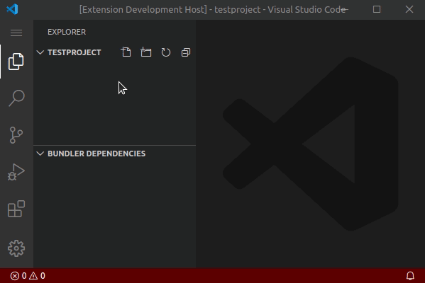

# VS Code extension for Bundler

This extension is in early development. Most of the planned features are not
implemented yet. If you encounter any bug, please report them in our [GitHub
repository](https://github.com/mbreit/vscode-bundler).

## Features

Already implemented features:

* Commands for `bundle install` and `bundle outdated`
* Tree view for Bundler dependencies:

Planned features are:

* Providing the most used Bundler commands as VS Code commands in the VS Code
  Command Palette and provide QuickPick inputs for arguments
* Adding a tree view to the Side Bar showing all Gemfiles in your workspace
  with their resolved dependencies, their version and their dependencies and
  some useful actions like opening the Gem in a new window or add it to the
  current workspace
* Showing useful Gem information, links and actions in the Gemfile with a Code
  Lens and/or hover provider

## Requirements

You must have Ruby and Bundler installed and in your `PATH` or set their
paths in the extension settings.

## Extension Settings

This extension contributes the following settings:

* `bundler.bundlerPath`: path to the Bundler executable, defaults to `bundle`
* `bundler.rubyPath`: path to the ruby executable, defaults to `ruby`

## Known Issues

See <https://github.com/mbreit/vscode-bundler/issues> for known issues.

## Release Notes

See [CHANGELOG.md](./CHANGELOG.md) for release notes.

## Contributing

* <https://www.conventionalcommits.org/en/v1.0.0/>

**Enjoy!**
